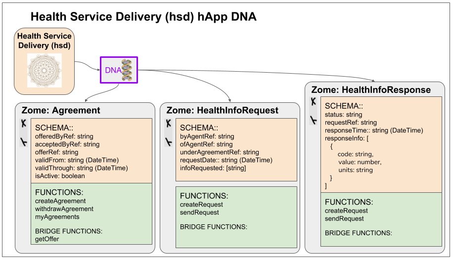
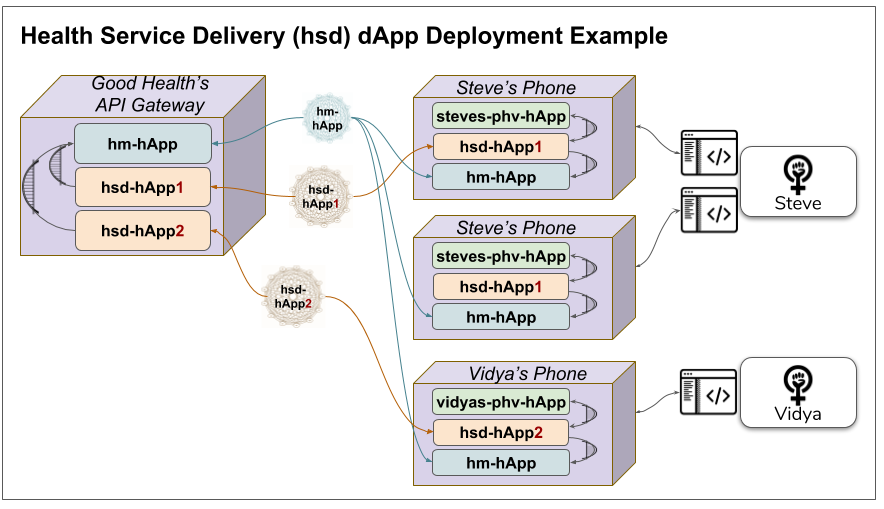

# Health Service Delivery hApp
The _Health Service Delivery hApp_ is one of a set of hApp's designed to work together to support the emergence of _**person-centric healthcare ecosystems**_ on top of a _holochain_ based infrastructure. Refer to the [holo-health project README](../README.md) for an overview of the project including its goals and guiding principles. Refer to [Holo-Health App Architecture](../holo-health-app-architecture.md) for an architectural overview.

# Overview
An instance of this _hsd_ hApp is created when a person _accepts_ a _Healthcare Service offer_ placed in the _Healthcare Market_ by a _Healthcare Provider_. The _hsd_ serves as a private channel between the two parties. Both the _agreement_ (which includes a reference to the _offer_ on which the _agreement_ was based) and the _requests_ and _responses_ made by either party, are recorded in the DHT for this hApp instance. This provides a secure, non-forgeable, immutable, non-repudiable audit trail that is necessary for both invoicing and regulatory compliance. 

The _Healthcare Service Delivery hApp_ is intended to support a very broad range of services (including both electronic and in-person) offered under a broad range of _agreement types_. 

# Proof of Concept (PoC) Simplistic Implementation 
The goal for the initial Proof-of-Concept (PoC) is to demonstrate the basic application architecture and hApp collaboration model. As such, a very simplistic concept of _healthcare service delivery_ will be implemented in the PoC.

* No support for _agreement types_, the PoC will only a support a single, implicitly defined agreement with the following _service flow_:
   1. _Healthcare provider_ issues _HealthInfoRequest_ for specified _observation codes_ from _consumer_
   1. The _hsd hApp_ will automatically check all such requests to ensure they comply with the terms specified in the _agreement_. If not, the request is  rejected.
   1. If the _request_ conforms to the _agreement_, the _hsd_ will build a _HealthInfoResponse_ to return to the _healthcare provider_. For each requested _observation code_ for which the consumer's _PersonalHealthRecord_ includes an _observation_, the _observation_ will be included in the response. 
   1. Upon receiving the _HealthInfoResponse_, the _hsd_ will invoke _handleResponse_ to trigger the _healthcare provider's_ analysis logic to analyze the personal health observations returned by the _consumer_ to arrive at a _health recommendation_. The    response is NOT included in the list of _observation codes_ defined in the _offer_, the HealthInfoRequest is rejected.
   1. All HealthInfoRequests, HealthInfoResponses, and Observations recorded are persisted to the DHT.

## DNA

The _hsd_ hApp defines three zomes:

### Agreement Zome
Designates an _agreement_ between a _healthcare provider_ who digitally signed an _offer_ into the _Health Marketplace_ and a _consumer_ who digitally signed their acceptance of the _offer_. The terms of the _agreement_ are as specified in the _offer_. _
_Agreement Schema_

`offeredByRef`: hash reference to the _healthcare provider_ agent that signed the _offer_ underlying this _agreement_ into the _Health Marketplace_.
`acceptedByRef`: hash reference to the _consumer_ that accepted the _offer_.
`offerRef`: hash reference to the signed _offer_.
`validFrom`: the DateTime at which the Agreement became valid.
`validThrough`: the DateTime at which the Agreement expires(d).
`isActive`: simple indicator of whether the _agreement_ is currently active.
`policies`: [string] -- in the PoC, a simple array of textual policies. These could evolve (after the PoC) to include a diverse array of _**pluggable governance**_ policies (e.g., cancellation policies, governance policies specifying how decisions regarding the agreement are made and disputes handled, non-disclosure agreements, upgrade policies, backward compatibility policies, etc.), some of which may be computationally enforceable policies (e.g., _smart contracts_).

Holochain's _validating DHT_ ensures that Agreements_ are:
   * _**Non-repudiable**_ -- neither party can claim they didn't enter into the _agreement_. The terms were baked into the _offer_ digitally signed by the _healthcare provider_. The _consumer's_ acceptance of those terms was digitally signed by the _consumer_ (and the body of the signed _agreement_ includes the hash of the _offer_). 
   * _**immutable**_ -- the _agreement_ and _offer_ cannot be altered without changing their hash, making the change obvious.
   * _**non-forgeable**_ -- due to the combination of digital signing by both parties and the hash of the contents. 

The _Agreement_ zome provides the following _functions_:

`getAgreement` -- allows an existing agreement to be retrieved from its id
`withdrawAgreement` -- sets the `isActive` flag to `false` provided the request to 
`getOffer` -- allows retreival of the _offer_ associated with the _agreement_

BRIDGE FUNCTIONS:
`createAgreement` -- allows a new _agreement_ to be made by a _consumer_ based on a (previously-) signed _offer_.

### HealthInfoRequest Zome

SCHEMA::
`byAgentRef` -- hash reference to the _healthcare provider_ agent who is making the _HealthInfoRequest_
`ofAgentRef` -- hash reference to the _consumer_ being asked to respond to this request.
`underAgreementRef` -- hash reference to the _agreement_ under which the request is being made.
`requestDate` -- the DateTime of the request.
`infoRequested`: [string] -- the list of _observation codes_ indicating the types of of personal health information being requested. To be _valid_, this list must ONLY include _codes_ that are designated by the _offer_. 

The _HealthInfoRequest_ zome provides the following _functions_:
`createRequest` -- used by the _healthcare provider_ to create a new HealthInfoRequest.
`sendRequest` -- commits the request to the _hsd_ DHT

### HealthInfoResponse Zome
<TODO>
SCHEMA:
`status`: string
`requestRef`: string
`responseTime`: string (DateTime)
`responseInfo: [
   {
       code: string,
        value: number,
        units: string
   }
]`

The _HealthInfoRequest_ zome provides the following _functions_:
`createResponse` -- 
`sendResponse` -- 
`handleResponse` --

## Proof of Concept (PoC) Deployment Architecture Example

# Future Enhancements
1. Allow a _personal health vault_ hApp to retrieve all of the _agreements_ for which that person is a _consumer_ (across all _hsd_ instances for that _consumer_).
1. Handle an extended range of _agreement types_ that enable more complex _service flows_.
   * Pay-per-service transactions using a _**pluggable currency**_
   * More complex _**service choreography**_.
1. Enhance privacy and security by supporting:
   * pairwise pseudonymous identities
   * encrypted payloads (using receiving agent's public key, so that only _that_ agent can decrypt the payload).

